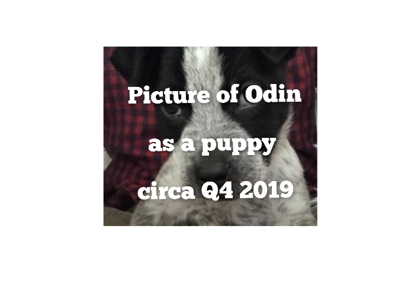

<!-- README.md is generated from README.Rmd. Please edit that file -->

# kuzco 

<!-- badges: start -->

<!-- badges: end -->

{kuzco} is a simple vision boilerplate built for ollama in R, on top of
{ollamar} & {ellmer}. {kuzco} is designed as a computer vision
assistant, giving local models guidance on classifying images and return
structured data. The goal is to standardize outputs for image
classification and use LLMs as an alternative option to keras or torch.

{kuzco} currently supports: classification, recognition, sentiment, text
extraction, alt-text creation, and **custom** computer vision tasks.

## Installation

You can install the development version of kuzco like so:

``` r
devtools::install_github("frankiethull/kuzco")
```

## Example

This is a basic example which shows you how to use kuzco.

``` r
library(kuzco)
library(ollamar)
```

here we have an image and want to learn about it:

``` r
test_img <- file.path(system.file(package = "kuzco"), "img/test_img.jpg") 
```

<figure>

<figcaption aria-hidden="true">picture of puppy odin circa
2019.</figcaption>
</figure>

### llm for image classification:

``` r
llm_results <- llm_image_classification(llm_model = "qwen2.5vl", image = test_img, 
                                        backend = 'ollamar')
```

``` r
llm_results |> tibble::as_tibble()
#> # A tibble: 1 × 7
#>   image_classification primary_object secondary_object image_description        
#>   <chr>                <chr>          <chr>            <chr>                    
#> 1 puppy                puppy          face             a close-up of a puppy wi…
#> # ℹ 3 more variables: image_colors <chr>, image_proba_names <list>,
#> #   image_proba_values <list>
```

``` r
llm_results |> str()
#> 'data.frame':    1 obs. of  7 variables:
#>  $ image_classification: chr "puppy"
#>  $ primary_object      : chr "puppy"
#>  $ secondary_object    : chr "face"
#>  $ image_description   : chr "a close-up of a puppy with a mix of black and white fur, looking directly at the camera with a curious expression."
#>  $ image_colors        : chr "#000000, #FFFFFF, #808080"
#>  $ image_proba_names   :List of 1
#>   ..$ : chr "puppy, puppy face, fur, eyes, nose"
#>  $ image_proba_values  :List of 1
#>   ..$ : chr "0.7, 0.2, 0.05, 0.05, 0.05"
```

### llm for image sentiment:

``` r
llm_emotion <- llm_image_sentiment(llm_model = "qwen2.5vl", image = test_img)

llm_emotion |> str()
#> 'data.frame':    1 obs. of  4 variables:
#>  $ image_sentiment      : chr "positive"
#>  $ image_score          : num 0.7
#>  $ sentiment_description: chr "The image evokes a sense of warmth and companionship."
#>  $ image_keywords       : chr "cute, friendly, fluffy"
```

### llm for image recognition:

note that the backend of kuzco is flexible as well. This allows users to
specify between ‘ollamar’, which suggests structured outputs, while
‘ellmer’ enforces structured outputs.

``` r
llm_detection <- llm_image_recognition(llm_model = "qwen2.5vl", 
                                       image = test_img,
                                       recognize_object = "nose",
                                       backend  = "ollamar")

llm_detection |> str()
#> 'data.frame':    1 obs. of  4 variables:
#>  $ object_recognized : chr "yes"
#>  $ object_count      : int 1
#>  $ object_description: chr "The nose is black and is located in the center of the image, slightly below the eyes."
#>  $ object_location   : chr "center"
```

### llm for image text extraction:

kuzco is also useful for OCR tasks, extracting text from images is
showcased below:

``` r
text_img <- file.path(system.file(package = "kuzco"), "img/text_img.jpg") 

text_img |> view_image()
```



``` r
llm_extract_txt <- llm_image_extract_text(llm_model = "qwen2.5vl", 
                                          image = text_img,
                                          backend  = "ellmer")

llm_extract_txt |> str()
#> 'data.frame':    3 obs. of  2 variables:
#>  $ text            : chr  "Picture of of Odin" "as a puppy" "circa Q4 2019"
#>  $ confidence_score: num  0.9 0.95 0.9
```

## newer features

### llm image customization:

a new feature in kuzco, is a fully customizable function. This allows
users to further test computer vision techniques without leaving the
kuzco boilerplate.

``` r
llm_customized <- llm_image_custom(llm_model = "qwen2.5vl", 
                                   image = test_img,
                                   system_prompt = "you are a dog breed expert, you know all about dogs. 
                                                    tell me the primary breed, secondary breed, and a brief description about both.",
                                   image_prompt  = "tell me what kind of dog is in the image?",
                                   example_df = data.frame(
                                     dog_breed_primary = "hound",
                                     dog_breed_secondary = "corgi",
                                     dog_breed_information = "information about the primary and secondary breed"
                                   ))

llm_customized |> str()
#> 'data.frame':    1 obs. of  3 variables:
#>  $ dog_breed_primary    : chr "Cane Corso"
#>  $ dog_breed_secondary  : chr "Boxer"
#>  $ dog_breed_information: chr "The dog in the image appears to be a mix of a Cane Corso and a Boxer. Cane Corsos are large dogs with a short c"| __truncated__
```

### additional enhancements:

kuzco now has `view_image` & `view_llm_results` functions within the
package, making it easy to view images and display llm results. In
addition to this, kuzco now features `kuzco_app` a fully functioning
shiny application within the package. Making it even easier to do
computer vision with LLMs in R.
